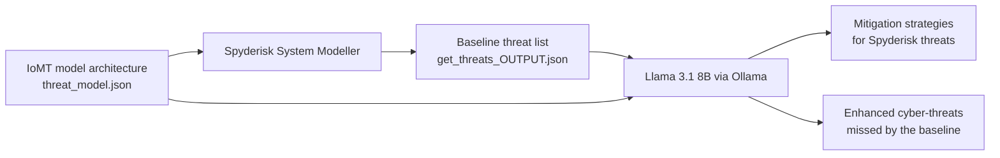

# Secure and Enhanced Cyber-Threat Detection in IoMT Using Locally Deployed Large Language Models

Reference implementation for the paper *Secure and Enhanced Cyber-Threat Detection in IoMT Using Locally Deployed Large Language Models* (Abbasi et al., IOS Press, Studies in Health Technology and Informatics, doi: [10.3233/SHTI260323](https://doi.org/10.3233/SHTI260323)).

The repository contains a two stage pipeline that pairs the [Spyderisk System Modeller](https://github.com/Spyderisk/system-modeller) with a locally deployed Llama 3.1 (8B) model served through [Ollama](https://ollama.com). Stage one asks the local model to propose mitigation strategies for threats that Spyderisk has already found. Stage two asks it to reason semantically over the raw architectural JSON and surface additional threats that the baseline tool missed. Because inference runs on the local machine, no patient identifiable information or architectural detail ever leaves the host, which is the privacy property that cloud hosted assistants cannot offer.

In the remote patient monitoring case study reported in the paper, the model returned 12 additional threats beyond the Spyderisk baseline.

## Pipeline



Formally, the architecture is represented as a set of components and data flows, the Spyderisk output as a set of threats with associated risk levels, and the model is used first as a mapping function from threats to controls and second as an inference function producing new threats conditioned on both inputs. Section 2 of the paper gives the full formulation.

## Repository contents

| File | Purpose |
| --- | --- |
| `threat_model.json` | IoMT architecture for the remote patient monitoring use case. Nine classes (Patient, Patients_Phone, Sensor_App, Sensor, Public, Patients_Work, Patients_House, Patients_Wifi, Patients_Router) and their relationships, exported from the modelling tool. |
| `get_threats_OUTPUT.json` | Baseline threat set exported from Spyderisk. 41 threat objects, each with a description, the asset it threatens, a likelihood label and a risk level label. |
| `prompts.py` | Prompt template for enhanced threat detection. Instructs the model to analyse every component and data flow against ISO, OWASP and NIST guidance, and to return only threats absent from the baseline list. |
| `threat_model_endpoint.py` | FastAPI service exposing `POST /process-threat-model`. Formats the prompt and shells out to the local model. |
| `threat_model_client.py` | Client that posts the architecture plus the baseline threats to the service above. |
| `Mitigation_endpoint.py` | FastAPI service exposing `POST /mitigate`. Issues one local model call per threat, appends a `mitigation_strategy` field, and flushes the growing result to disk after every threat so a long run can be interrupted safely. |
| `Mitigation_client.py` | Client that posts the Spyderisk threat file to the mitigation service. |

## Requirements

* Python 3.9 or newer
* [Ollama](https://ollama.com) installed and running locally, with the Llama 3.1 8B weights pulled
* Python packages: `fastapi`, `uvicorn`, `pydantic`, `requests`

Hardware used in the paper: a 12th generation Intel Core i7 12900H at 2.50 GHz. A GPU is not required for the 8B model but shortens each run considerably.

## Installation

```bash
git clone https://github.com/<your-username>/<your-repo>.git
cd <your-repo>

python -m venv .venv
source .venv/bin/activate        # Windows: .venv\Scripts\activate
pip install fastapi uvicorn pydantic requests

ollama pull llama3.1:8b
```

## Usage

### Stage 1: mitigation strategies for baseline threats

```bash
uvicorn Mitigation_endpoint:app --host 127.0.0.1 --port 8000
python Mitigation_client.py path/to/get_threats_OUTPUT.json
```

Each threat object is sent to the model on its own, with a system role of "You are a cybersecurity expert specialising in threat modelling, mitigation planning, and secure architecture for IoT and medical systems." The service writes a timestamped file to `mitigation_outputs/mitigations_<UTC timestamp>.json` and returns both the file path and the enriched threat list. Results corresponding to Table 1 of the paper come from this stage.

### Stage 2: enhanced threat detection

```bash
uvicorn threat_model_endpoint:app --host 127.0.0.1 --port 8010
python threat_model_client.py path/to/threat_model.json path/to/get_threats_OUTPUT.json
```

The service fills the template in `prompts.py` with the architecture and the baseline threat list, then returns the model output as a table of component or data flow, threat, threat type, mitigation method and rationale. Results corresponding to Table 2 of the paper come from this stage.

Both clients accept file paths as command-line arguments, so you can point them at any local JSON file without editing the source code.

## Reproducing the reported results

The protocol described in Section 2.1 of the paper:

1. Inference temperature set to 0.2 to reduce stochastic variance.
2. Maximum token limit capped at 4,000 so that complete IoMT JSON objects are processed.
3. Five independent inference runs. A threat was included in Table 2 only if it appeared in at least four of the five runs.

The temperature and token cap are not currently set in `call_local_model`. To reproduce the paper exactly, pass them through Ollama, either with an options payload against the Ollama HTTP API at `http://localhost:11434/api/generate` or through a Modelfile that sets `PARAMETER temperature 0.2` and `PARAMETER num_predict 4000`.


## Disclaimer

This is a research prototype produced for academic evaluation. It is not a certified security assessment tool and its output must not be treated as a substitute for a professional risk assessment or for regulatory conformity assessment of a medical device. Threats and controls generated by a language model require expert review before any operational use.

## Sources and credits

**Spyderisk System Modeller.** The baseline threat set in `get_threats_OUTPUT.json` was produced with Spyderisk, an open source automated risk assessment tool developed over more than a decade at the University of Southampton IT Innovation Centre and released under open licences in 2023. Spyderisk supports the risk assessment process defined in ISO 27005 and the information security management system defined in ISO 27001. Software is licensed under Apache 2.0 and is copyright University of Southampton IT Innovation Centre.

* Source: https://github.com/Spyderisk/system-modeller
* Deployment: https://github.com/Spyderisk/system-modeller-deployment
* Documentation: https://docs.spyderisk.org/system-modeller/latest/
* Project: https://www.southampton.ac.uk/research/projects/spyderisk
* Method paper: S. C. Phillips, S. Taylor, M. Boniface, S. Modafferi and M. Surridge, "Automated Knowledge-Based Cybersecurity Risk Assessment of Cyber-Physical Systems," *IEEE Access*, vol. 12, pp. 82482 to 82505, 2024.

**Llama 3.1 (8B).** Model weights by Meta, used under the Llama 3.1 Community License. See https://www.llama.com/llama3_1/license/

**Ollama.** Local model serving framework, MIT licensed. See https://github.com/ollama/ollama

**FastAPI, Uvicorn, Pydantic, Requests.** Web service and HTTP client stack, all MIT or BSD licensed.

**Standards referenced in the prompts and in the generated controls.** ISO/IEC 27001 and ISO/IEC 27005, the NIST Cybersecurity Framework and NIST SP 800-30, and the OWASP IoT and Mobile Top Ten.

**Related tools discussed in the paper.** vsRisk by Vigilant Software, and the CORAS based multi agent threat modelling work of Erdogan et al.

## Citation

If you use this code, please cite the paper:

```bibtex
@inproceedings{abbasi2026secure,
  title     = {Secure and Enhanced Cyber-Threat Detection in IoMT Using Locally Deployed Large Language Models},
  author    = {Abbasi, Saadullah Farooq and Bilal, Muhammad and Ding, Xuefei and Bai, Linxue and Pournik, Omid and Islam, Saif Ul and Epiphaniou, Gregory and Maple, Carsten and Arvanitis, Theodoros N.},
  booktitle = {Studies in Health Technology and Informatics},
  publisher = {IOS Press},
  volume    = {336},
  doi       = {10.3233/SHTI260323}
}
```

The earlier vision language study that this work builds on:

```bibtex
@inproceedings{abbasi2025preliminary,
  title     = {Preliminary Exploration of Pre-Trained Vision-Language Models for Cyber-Threat Modelling in Internet of Medical Things (IoMT)},
  author    = {Abbasi, Saadullah Farooq and Bilal, Muhammad and Mukherjee, Tanaya and Pournik, Omid and Moukafih, Nabil and Epiphaniou, Gregory and others},
  booktitle = {35th Medical Informatics Europe Conference (MIE 2025)},
  publisher = {IOS Press},
  pages     = {1195--1199},
  year      = {2025}
}
```

## Authors

Saadullah Farooq Abbasi, Muhammad Bilal, Xuefei Ding, Linxue Bai, Omid Pournik, Saif Ul Islam, Gregory Epiphaniou, Carsten Maple and Theodoros N. Arvanitis.

Department of Electronic, Electrical and Systems Engineering, University of Birmingham; School of Engineering, University of Edinburgh; WMG, University of Warwick.

Corresponding author: Prof. Theodoros N. Arvanitis, T.Arvanitis@bham.ac.uk
You can also contact: Dr. Saadullah Farooq Abbasi S.f.abbasi@bham.ac.uk 

## Acknowledgement

This work is partially funded by Advanced Security-for-safety Assurance for Medical Device IoT (MedSecurance), Grant Agreement number 101095448, and Innovative Applications of Assessment and Assurance of Data and Synthetic Data for Regulatory Decision Support (InSafeDare), Grant Agreement number 101095661.
